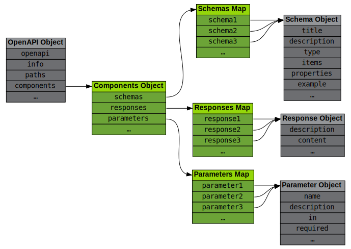

# Reusing Descriptions

The examples given so far have started to grow large because of the verbose nature of OpenAPI documents. This page introduces a mechanism to remove redundancy from the document by reusing portions of it.

## The Components Object

The [Components Object](https://spec.openapis.org/oas/v3.0.3#componentsObject),
accessible through the `components` field in the root [OpenAPI Object](https://spec.openapis.org/oas/v3.0.3#oasObject), contains definitions for objects to be reused in other parts of the document.

<figure style="text-align:center">
  
  <figcaption></figcaption>
</figure>

Most objects in the OAS can be replaced by a **reference** to a **component**, drastically reducing document size and maintenance (just like methods do in programming languages).

Not all objects can be referenced, though, only those listed as fields of the [Components Object](https://spec.openapis.org/oas/v3.0.3#componentsObject) like `schemas`, `responses` and `parameters` to name a few.

Each field in the [Components Object](https://spec.openapis.org/oas/v3.0.3#componentsObject) is a map pairing component names with objects to be reused. The type of these objects must match the parent field, e.g. objects in the `schemas` map must be [Schema Objects](https://spec.openapis.org/oas/v3.0.3#schemaObject).

```yaml
components:
  schemas:
    coordinate:
      type: integer
      minimum: 1
      maximum: 3
  parameters:
    rowParam:
      name: row
      in: path
      required: true
```

The above example defines two components:

- `coordinate` is a schema component, usable wherever a [Schema Object](https://spec.openapis.org/oas/v3.0.3#schemaObject) is expected.
- `rowParam` is a parameter component, usable wherever a [Parameter Object](https://spec.openapis.org/oas/v3.0.3#parameterObject) is expected.

The next section explains how to reference these components.

## The Reference Object

Any OpenAPI object of the types supported by the [Components Object](https://spec.openapis.org/oas/v3.0.3#componentsObject) can be replaced by a [Reference Object](https://spec.openapis.org/oas/v3.0.3#referenceObject) pointing to a component.

[Reference Objects](https://spec.openapis.org/oas/v3.0.3#referenceObject) are actually [JSON References](https://tools.ietf.org/html/draft-pbryan-zyp-json-ref-03): they contain a single field named `$ref` and its string value is a URI pointing to the referenced object:

```yaml
  $ref: 'https://gigantic-server.com/schemas/Monster/schema.yaml'
```

References can be absolute or relative, and they can include a fragment identifier

```yaml
$ref: './another_file.yaml#rowParam'
```

To complete the example from the previous section:

```yaml
components:
  schemas:
    coordinate:
      type: integer
      minimum: 1
      maximum: 3
  parameters:
    rowParam:
      name: row
      in: path
      required: true
      schema:
        $ref: "#/components/schemas/coordinate"
    columnParam:
      name: column
      in: path
      required: true
      schema:
        $ref: "#/components/schemas/coordinate"
paths:
  /board/{row}/{column}:
    parameters:
      - $ref: "#/components/parameters/rowParam"
      - $ref: "#/components/parameters/columnParam"
```

Note how all references point to different fragments inside the same document (the one being processed).

Note also how the `coordinate` schema is used twice (in the `rowParam` and `columnParam` parameters), and how these two parameters are referenced from the `/board/{row}/{column}` path.

## Tic Tac Toe Example

The complete [Tic Tac Toe sample API](examples/tictactoe.yaml) (not included here for brevity) makes heavy use of components. Note for example how different endpoints return a `#/components/schemas/status` on success, or a `#/components/schemas/errorMessage` on error.

## Summary

Whenever the same piece of JSON or YAML is repeated in an OpenAPI document, it is probably worth converting it into a component and referencing it everywhere else.

Furthermore, [Reference Objects](https://spec.openapis.org/oas/v3.0.3#referenceObject) allow splitting a document into several files to keep them organized and their individual size manageable.

This page has shown that:

- Reusable [Components Objects](https://spec.openapis.org/oas/v3.0.3#componentsObject) can be defined by using the `components` field of the root [OpenAPI Object](https://spec.openapis.org/oas/v3.0.3#oasObject).
- Components can be referenced from any place where an object of the same type is expected using `$ref`.
- References are actually URIs so they are very flexible.

[The next page](specification-examples.md) explains how to include examples in an OpenAPI document.
